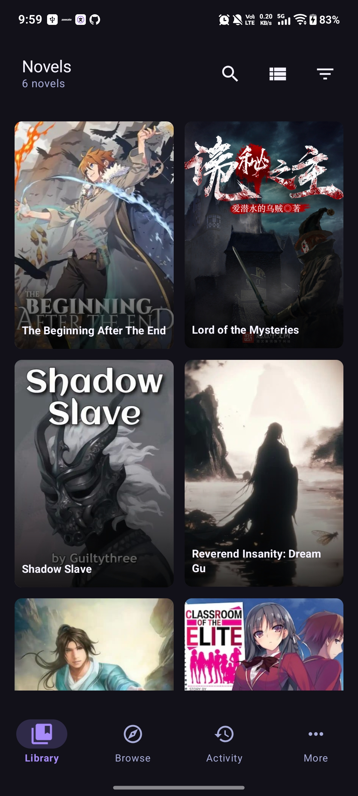
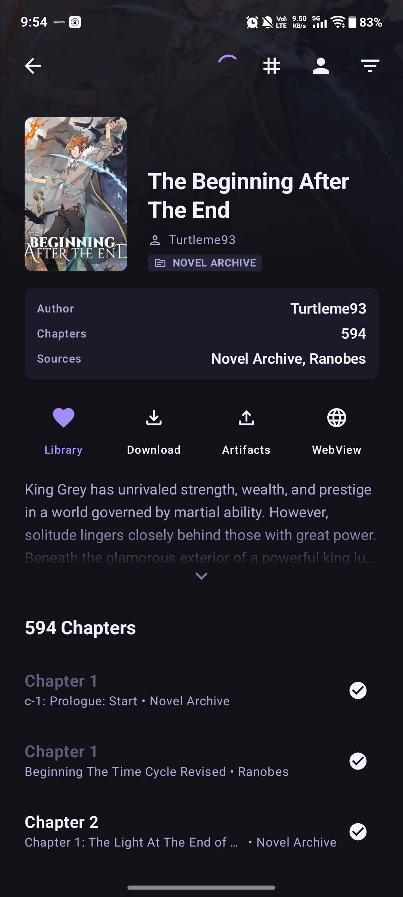
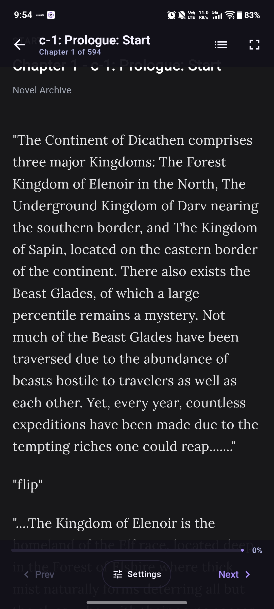
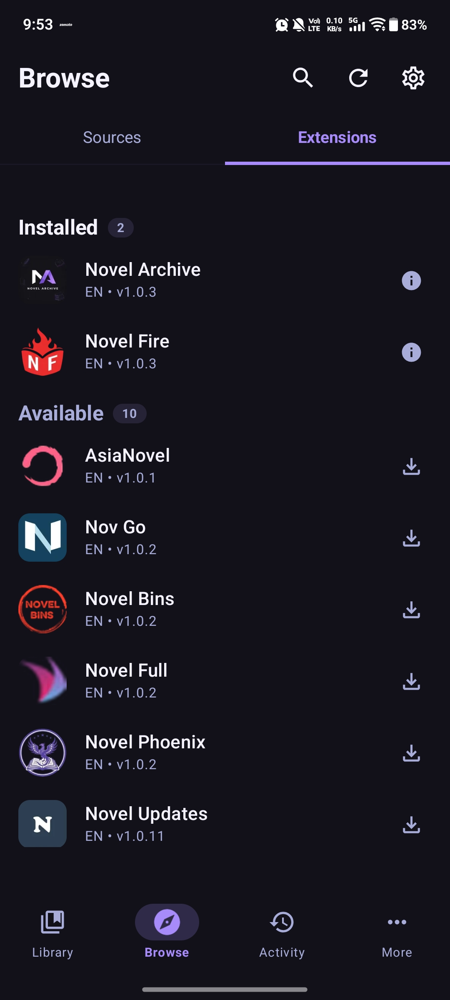
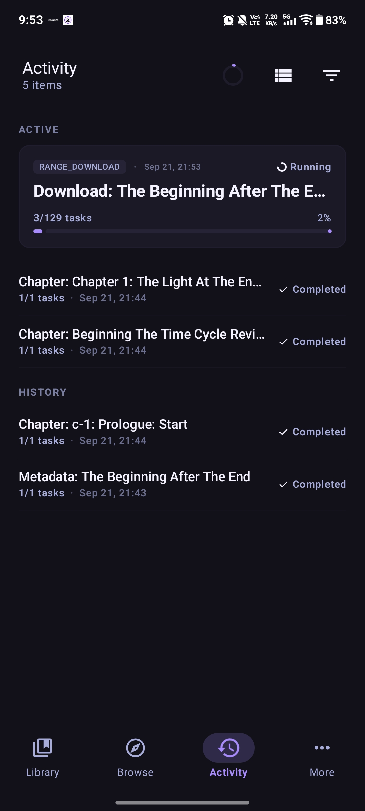
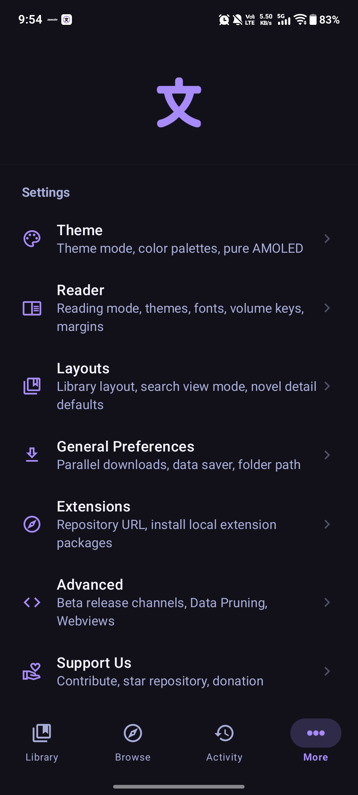

# Bunori

### Modern Web Novel Reader and Exporter

 

 

 

 

<h1>Screenshots</h1>

---

<h1>Features</h1>

<table>
  <tr>
    <td width="50%" valign="top">

#### In-Built Reader
- Tailored typography, custom fonts, letter spacings and line heights 
- Tap navigation zones, customisable screen margins
- Various theme palleted along with True AMOLED

</td>
    <td width="50%" valign="top">

#### BEXT Extension System
- Sandboxed extensions compiled to webassembly via WAMR runtime
- Install update manage sources independently without app updates
- Fast HTML parsing with native performance bridges

</td>
  </tr>
  <tr>
    <td width="50%" valign="top">

#### Batch & Task Download
- Concurrency controlled downloading with source rate limiting & Jitter
- Automatic retires, Back Off Delays and auto resume
- Foreground notification and live tracking

</td>
    <td width="50%" valign="top">

#### Artifact & Storage
- Export downloaded chapters to standalone files
- Efficient `.html.gz` compressed chapter storage on disk
- Filter through scanlation and other aspects to download speceific chapters

</td>
  </tr>
  <tr>
    <td width="50%" valign="top">

#### Headless Webview & Webkit Engine
- Headless webview resolver handles non-interactive bot prevention challenges
- Manual Cookie entry and browser debug modes for difficult sources

</td>
    <td width="50%" valign="top">

#### Automation & Backup
- Scheduled background workers for novel pruning and cache clearing
- Full database backup and restore to JSON archives

</td>
  </tr>
</table>

---

<h1>Download Now</h1>

<table>
  <tr>
    <th align="center">GitHub</th>
  </tr>
  <tr>
    <td align="center">
      
    </td>
  </tr>
</table>

*Supports `arm64-v8a` (modern Android devices) and `x86_64` (emulators).*

---

<h1>Support the Project</h1>

<h3>Bunori is free and open-source. If you find it useful, consider supporting the development!</h3>

#### Buy Me a Coffee

---

<h1>Special Thanks</h1>

<h3>Bunori took a lot of inspiration from these incredible open-source work.</h3>

---

<h1>Contributors</h1>

<h3>Thanks to everyone who contributes to Bunori!</h3>

